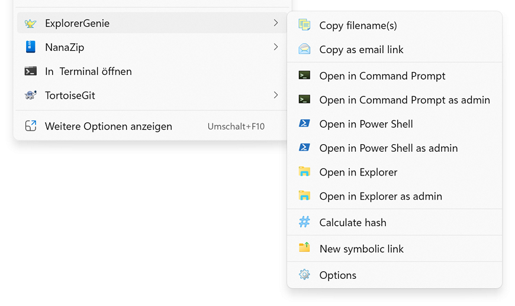
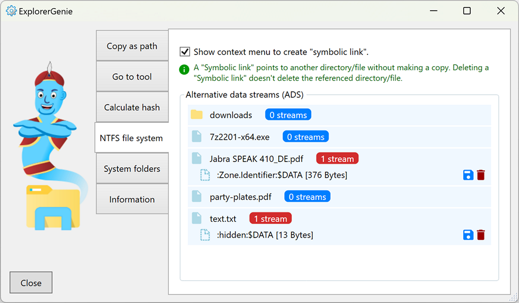

# ExplorerGenie

https://www.martinstoeckli.ch/explorergenie

ExplorerGenie is an open source extension to the context menu of the Windows explorer, which allows to copy the path of a file to the clipboard, or to open tools like the Command Line. The menu is configurable, so that you get those functions you really need.

## Copy file path

This extension adds a context menu, which can copy the paths of the selected files or directories to the clipboard.

## Go to tool

This extension makes it easy to open tools like the Command Line or Power Shell. It is possible to add user defined menu entries which can open other tools, or go to certain locations.

## Show and delete alternative data streams (ADS)

Alternative data streams are hidden parts, which can be added to a file or directory on the NTFS file system. They don't show up in the explorer and wont be represented in the file size. The most common use case of ADS are added zone informations of downloaded files, so Windows knows where they came from and that they are potentially unsafe. But also malware can try to hide its information in an ADS and load it from there if needed, to avoid detection. ExplorerGenie makes it simple to find those ADS, export them to standalone files for examination and to delete them.

## Create symbolic links

Windows 11 comes with a handy feature in the Explorer, to create links to other folders. Such linked folders become part of the folder tree and can be handled the same way, but they are actually referring to a foreign directory. This is useful whenever you want to keep data in one directory up to date and consuming it in multiple other directories. With ExplorerGenie such symbolic links can now also be created in Windows 10.

## Calculate file hashes

ExplorerGenie can calculate some well-known hashes for the selected files, the list includes the algorithms MD5, SHA-1, SHA-256, SHA-384, SHA-256 and RIPEMD-160.

## Minimal Explorer impact

Because context menus run inside the explorer process itself (shell-extension), and therefore can potentially interfere with this process, we took special care about the stability of this extension.

- The code of the shell extension is kept to a minimum, it only starts the real application, which does the work and is running in its own separate process.
- The shell extension is written in Delphi, which compiles to native applications. This way we can avoid loading of a (DotNet) runtime and possible version conflicts, and do not impact performance of explorer and file-open dialogs.

## Credits

* We got a free version of the [Advanced Installer](https://www.advancedinstaller.com), which simplifies the distribution of this open source app tremendous.
