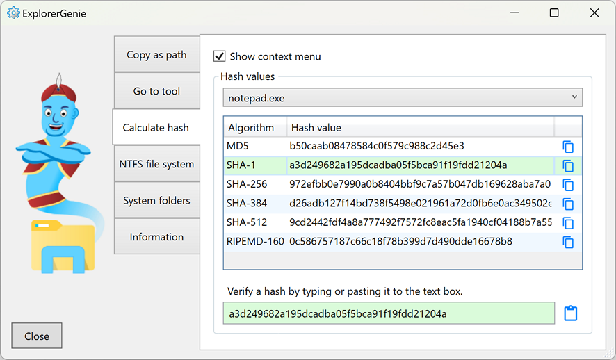

# ExplorerGenie

https://www.martinstoeckli.ch/explorergenie

ExplorerGenie is an open source extension to the context menu of the Windows explorer, which allows to copy the path of a file to the clipboard, or to open tools like the Command Line. The menu is configurable, so that you get those functions you really need.

## Copy file path

This extension adds a context menu, which can copy the paths of the selected files or directories to the clipboard.

## Go to tool

This extension makes it easy to open tools like the Command Line or Power Shell.

## Calculate file hashes

ExplorerGenie can calculate some well-known hashes for the selected files, the list includes the algorithms MD5, SHA-1, SHA-256, SHA-384, SHA-256 and RIPEMD-160.

## Minimal Explorer impact

Because context menus run inside the explorer process itself (shell-extension), and therefore can potentially interfere with this process, we took special care about the stability of this extension.

- The code of the shell extension is kept to a minimum, it only starts the real application, which does the work and is running in its own separate process.
- The shell extension is written in Delphi, which compiles to native applications. This way we can avoid loading of a (DotNet) runtime and possible version conflicts, and do not impact performance of explorer and file-open dialogs.

## Credits

* We got a free version of the [Advanced Installer](https://www.advancedinstaller.com), which simplifies the distribution of this open source app tremendous.
